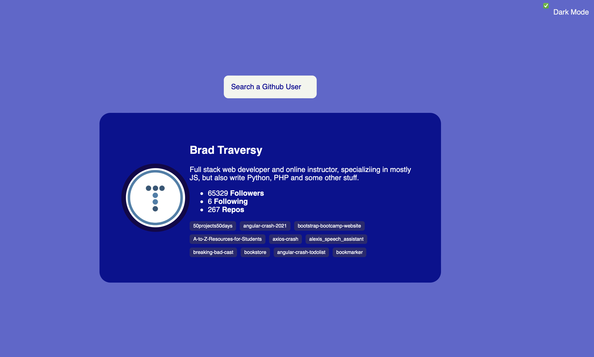

# GitHub Profiles Clone Project

This is a simple JavaScript, HTML, and CSS project that allows users to view GitHub user profiles. It retrieves information such as the user's name, description, followers, following, and public repositories using the GitHub API. Part of the project has been inspired by Florin Pop's YouTube tutorial titled: [10 JavaScript Projects in 10 Hours - Coding challenge.](https://www.youtube.com/watch?v=dtKciwk_si4)

## Demo

[View Demo](https://github.com/brigitabi/GitHubProfilesClone)

### Light Mode 


### Dark Mode 


## Features

GitHubl Profiles Clone website: 

- Displays the user's name and description.
- Shows the number of followers and following.
- Lists the user's public repositories.

## Technologies Used

- JavaScript
- HTML
- CSS

## Usage

1. Clone the repository:

   ```bash
   git clone git@github.com:brigitabi/GitHubProfilesClone.git

2. Open the project in your preferred code editor.
3. Launch a live server to view the project locally. You can use various methods to open the project with a live server:
If you have a live server extension installed in your code editor (such as VS Code's Live Server extension), right-click on the index.html file and choose the option to open it with a live server.
Alternatively, you can use the "Serve" feature of popular development tools like Node.js, Python's SimpleHTTPServer, or any other web server of your choice.
4. Once the live server is running, you can access the project in your web browser by navigating to the provided URL.

Happy coding! 
